<div align="center">




</div>

---

## 🌌 About Me

I'm an **Information Systems student** with a strong interest in backend development, software architecture, and building practical systems.

I enjoy understanding how systems work behind the scenes, turning ideas into working software, and continuously improving through real-world projects.

```yaml
name: Muhammad Ilham
username: dims154
location: Jambi, Indonesia

role:
  - Information Systems Student
  - Backend Developer
  - System Enthusiast

focus:
  - Backend Development
  - System Design
  - Enterprise Architecture
  - Database Design
  - Automation
  - Data Analytics

interests:
  - Building Real World Systems
  - Software Architecture
  - Business Intelligence
  - Open Source
  - Continuous Learning
```

---

## 🚀 Tech Stack

<div align="center">

### 💻 Programming Languages


### ⚙️ Backend & Framework


### 🗄️ Database


### 🛠️ Development Tools


### 🌐 Web Technologies


</div>

---

## 📊 GitHub Statistics


<p align="center">
<sub>🔄 Automatically generated and updated with GitHub Actions</sub>
</p>

---

## 📈 Contribution Activity


<p align="center">
<sub>Last 31 days · Automatically generated with GitHub Actions</sub>
</p>

---

## 🎯 Current Focus

| 🎯 Area | 🚀 Current Focus |
| :---: | :--- |
| ⚙️ **Backend** | Building practical and scalable backend applications |
| 🏗️ **Architecture** | Learning system design and enterprise architecture |
| 🗄️ **Database** | Designing structured and reliable data systems |
| 🤖 **Automation** | Building bots, workflows, and integrations |
| 📊 **Analytics** | Exploring data analytics and business intelligence |
| 🧠 **Problem Solving** | Improving programming and logical thinking |
| 🌱 **Open Source** | Learning through real-world projects |

---

## 🛠️ What I'm Building

### 🤖 Backend & Automation

Building backend systems and automation workflows with a focus on:

- API development
- Command-based architecture
- Authentication & authorization
- Permission systems
- User management
- Automation
- Structured data

### 🏢 Enterprise Systems

Exploring enterprise-oriented software architecture through:

- Modular architecture
- Multi-tenant systems
- Tenant isolation
- Database design
- Scalable backend architecture
- System integration

### 📊 Data & Business Systems

Exploring applications involving:

- Inventory management
- Product management
- Customer management
- Transactions
- Reporting
- Business analytics

---

## 🧠 Development Philosophy

```text
             ┌───────────┐
             │   LEARN   │
             └─────┬─────┘
                   │
                   ▼
             ┌───────────┐
             │   BUILD   │
             └─────┬─────┘
                   │
                   ▼
             ┌───────────┐
             │   BREAK   │
             └─────┬─────┘
                   │
                   ▼
             ┌───────────┐
             │   DEBUG   │
             └─────┬─────┘
                   │
                   ▼
             ┌───────────┐
             │UNDERSTAND │
             └─────┬─────┘
                   │
                   ▼
             ┌───────────┐
             │  IMPROVE  │
             └─────┬─────┘
                   │
                   └──────────────► REPEAT
```

> I don't aim to write perfect code from the beginning.
>
> I aim to understand **why it works, why it fails, and how it can be improved.**

---

## 📚 Currently Learning

| Technology / Concept | Focus |
| :--- | :--- |
| 🐍 **Python** | Programming & automation |
| 🐘 **PHP / Laravel** | Backend development |
| 🟨 **JavaScript / Node.js** | Backend & integrations |
| 🏗️ **System Design** | Scalable software architecture |
| 🏢 **Enterprise Architecture** | Business-oriented system design |
| 🗄️ **Database Design** | Data modeling & optimization |
| 🤖 **GitHub Actions** | CI/CD & automation |

---

## 🔥 Areas of Interest

<table>
<tr>
<td width="50%" align="center">

### ⚙️ Backend Development

APIs, business logic, authentication, databases, integrations, and backend architecture.

</td>
<td width="50%" align="center">

### 🏢 Enterprise Architecture

System structure, modularity, scalability, maintainability, and business processes.

</td>
</tr>

<tr>
<td width="50%" align="center">

### 🤖 Automation

Bots, workflows, scheduled tasks, integrations, and developer automation.

</td>
<td width="50%" align="center">

### 📊 Data & Analytics

Databases, reporting, analytics, and business intelligence.

</td>
</tr>
</table>

---

## 🔄 Development Workflow

```text
             ┌───────────┐
             │   IDEA    │
             └─────┬─────┘
                   │
                   ▼
             ┌───────────┐
             │  DESIGN   │
             └─────┬─────┘
                   │
                   ▼
             ┌───────────┐
             │   CODE    │
             └─────┬─────┘
                   │
                   ▼
             ┌───────────┐
             │   TEST    │
             └─────┬─────┘
                   │
                   ▼
             ┌───────────┐
             │  DEBUG    │
             └─────┬─────┘
                   │
                   ▼
             ┌───────────┐
             │  IMPROVE  │
             └─────┬─────┘
                   │
                   ▼
             ┌───────────┐
             │  DEPLOY   │
             └─────┬─────┘
                   │
                   ▼
             ┌───────────┐
             │   LEARN   │
             └─────┬─────┘
                   │
                   └──────────────► REPEAT
```

---

## 📌 GitHub Automation

This profile uses **GitHub Actions** to automatically generate and update GitHub statistics.

```text
GitHub API
     │
     ▼
GitHub Actions
     │
     ├── Contributions
     ├── Repositories
     ├── Followers
     ├── Contribution Streak
     └── Top Languages
     │
     ▼
Generate SVG
     │
     ▼
stats/
 ├── github-stats.svg
 ├── top-languages.svg
 ├── streak.svg
 └── contribution-activity.svg
     │
     ▼
README.md
```

The statistics and contribution activity are generated from GitHub data and stored directly inside this repository.

---

## 🌐 Connect With Me

<div align="center">

[](https://github.com/dims154)
[](https://wa.me/6287785567289)

</div>

---

<div align="center">

### ⚡ Code • Build • Learn • Improve • Repeat

*"Every expert was once a beginner."*

<br>


<br><br>

<sub>Thanks for visiting my profile 🚀</sub>

</div>
