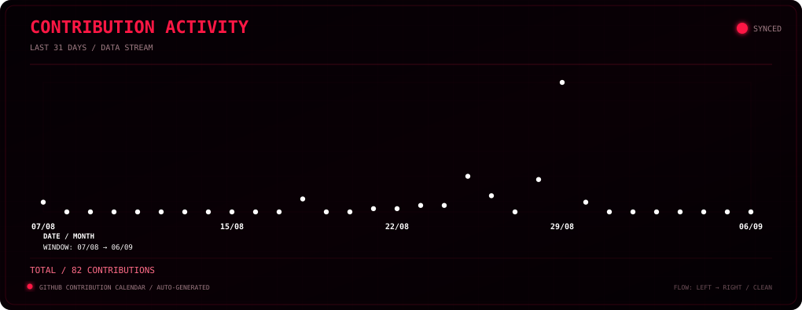

  

👨‍💻 About Me

<table>
<tr>
<td width="65%" valign="top">

I'm an Information Systems student with a strong interest in backend development, system architecture, automation, and practical software systems.

I enjoy understanding what happens behind the interface — from business logic and databases to APIs, architecture, integrations, and automation.

My goal is not simply to write code.

I want to understand the system behind the code.

</td>
<td width="35%" valign="top">

🛰️ System Status

🟢 Status

Online

⚙️ Role

Backend Developer

🎓 Study

Information Systems

📍 Location

Jambi, Indonesia

🔧 Mode

Build · Learn · Improve

</td>
</tr>
</table>

🧬 Profile Data

<table>
<tr>
<td width="50%" valign="top">

Identity

Name: Muhammad Ilham

Username: dims154

Location: Jambi, Indonesia

Role: Information Systems Student

Role: Backend Developer

</td>
<td width="50%" valign="top">

Primary Focus

Backend Development

System Design

Enterprise Architecture

Database Design

Automation

Data Analytics

</td>
</tr>
</table>

🚀 Tech Stack

💻 Programming Languages

  

⚙️ Backend & Framework

  

🗄️ Database

  

🛠️ Development Tools

  

🌐 Web Technologies

📊 GitHub Intelligence

<table>
<tr>
<td width="50%" align="center">

</td>
<td width="50%" align="center">

</td>
</tr>
<tr>
<td width="50%" align="center">

</td>
<td width="50%" align="center">

⚡ LIVE PROFILE DATA

Automatically generated from GitHub activity.

Repositories · Commits · Languages · Streak

</td>
</tr>
</table>

⚡ Automatically generated and updated with GitHub Actions

📈 Contribution Activity

 

Last 31 days · Automatically generated from GitHub activity

🎯 Current Mission

<table>
<tr>
<td width="50%" valign="top">

⚙️ Backend

Building practical backend applications with:

API development

Business logic

Authentication & authorization

Database integration

System integrations

Backend architecture

</td>
<td width="50%" valign="top">

🏗️ System Architecture

Learning to design systems that are:

Modular

Maintainable

Scalable

Secure

Reliable

Business-oriented

</td>
</tr>
<tr>
<td width="50%" valign="top">

🤖 Automation

Exploring:

Bots

Workflows

GitHub Actions

Scheduled systems

API integrations

Developer automation

</td>
<td width="50%" valign="top">

📊 Data

Working with:

Database design

Data analytics

Reporting

Business intelligence

Structured data

Data-driven systems

</td>
</tr>
</table>

🛠️ What I'm Building

<table>
<tr>
<td width="33%" valign="top">

🤖 Backend & Automation

Practical backend systems focused on:

APIs

Command-based architecture

Authentication

Authorization

Permission systems

User management

Structured output

Automation workflows

</td>
<td width="33%" valign="top">

🏢 Enterprise Systems

Exploring enterprise architecture through:

Modular architecture

Multi-tenant systems

Tenant isolation

Database design

Scalable backend architecture

System integration

Business processes

</td>
<td width="33%" valign="top">

📊 Business Systems

Exploring systems involving:

Inventory management

Product management

Customer management

Transactions

Reporting

Business analytics

Business intelligence

</td>
</tr>
</table>

🧠 Development Philosophy

LEARN → BUILD → BREAK → DEBUG → UNDERSTAND → IMPROVE → REPEAT

I don't aim to write perfect code from the beginning.

I aim to understand why it works, why it fails, and how it can be improved.

📚 Currently Learning

<table>
<tr>
<th>Technology / Concept</th>
<th>Focus</th>
</tr>
<tr><td>🐍 <b>Python</b></td><td>Programming & automation</td></tr>
<tr><td>🐘 <b>PHP / Laravel</b></td><td>Backend development</td></tr>
<tr><td>🟨 <b>JavaScript / Node.js</b></td><td>Backend & integrations</td></tr>
<tr><td>🏗️ <b>System Design</b></td><td>Scalable software architecture</td></tr>
<tr><td>🏢 <b>Enterprise Architecture</b></td><td>Business-oriented system design</td></tr>
<tr><td>🗄️ <b>Database Design</b></td><td>Data modeling & optimization</td></tr>
<tr><td>🤖 <b>GitHub Actions</b></td><td>CI/CD & automation</td></tr>
</table>

🔥 Areas of Interest

<table>
<tr>
<td width="25%" align="center" valign="top">

⚙️ Backend

APIs
Business Logic
Databases
Integrations

</td>
<td width="25%" align="center" valign="top">

🏢 Enterprise

Architecture
Scalability
Modularity
Maintainability

</td>
<td width="25%" align="center" valign="top">

🤖 Automation

Bots
Workflows
Integrations
CI/CD

</td>
<td width="25%" align="center" valign="top">

📊 Data

Analytics
Reporting
Business Intelligence
Data Systems

</td>
</tr>
</table>

🔄 Development Workflow

IDEA → DESIGN → CODE → TEST → DEBUG → IMPROVE → DEPLOY → LEARN → REPEAT

🤖 GitHub Automation

This profile uses GitHub Actions to automatically generate and update profile statistics and visual assets.

GitHub API → GitHub Actions → Generate SVG → README

Automated Components

GitHub statistics

Repository statistics

Top languages

Contribution streak

Contribution activity

Cyberpunk profile hero

Scheduled profile updates

🧩 Profile Components

dims154/
├── README.md
├── assets/
│   └── profile-hero.svg
├── stats/
│   ├── github-stats.svg
│   ├── top-languages.svg
│   ├── streak.svg
│   └── contribution-activity.svg
└── .github/
    └── workflows/
        └── update-profile.yml

🌐 Connect With Me

  

  

⚡ CODE • BUILD • LEARN • IMPROVE • REPEAT

Thanks for visiting my profile 🚀

